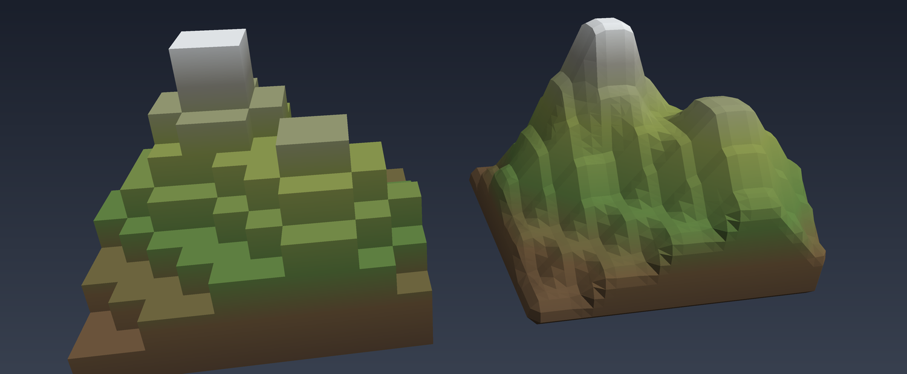

# minimal_transvoxel

A minimal, `std`-only polygonizer for the two cell types of the
[Transvoxel algorithm](https://transvoxel.org/) (Eric Lengyel).



Both terrains above come from **the same 10x10 heightmap** of stacked cubes.

On the **left** is the Minecraft-style input drawn literally: 100 columns of
unit cubes, one per grid square, so every slope is a staircase of hard right
angles.

On the **right** is what this crate makes of it. The heightmap is read as a
continuous field instead of a step function, and the polygonizer traces the
surface where that field crosses zero — cube by cube, each one solved on its own
from its 8 corner samples, then joined up. The staircase becomes a hillside, the
summit becomes a peak, and no cell ever knew about its neighbours.

Both are closed solids, and both are produced by
`cargo run --example terrain_obj`.

No grid, no chunks, no LOD bookkeeping — just samples in, triangles out, so the
algorithm can be exercised on its own:

```rust
use minimal_transvoxel::{polygonize_regular_cell, polygonize_transition_cell};

// A cube, from its 8 corner samples. Negative = inside solid.
let mesh = polygonize_regular_cell(&[-1.0, 1.0, 1.0, 1.0, 1.0, 1.0, 1.0, 1.0]);
assert_eq!(mesh.triangles.len(), 1);

// A transition cell, from the 9 high-resolution samples of its fine face.
let mesh = polygonize_transition_cell(&[-1.0; 9]);
assert!(mesh.triangles.is_empty()); // fully solid, nothing to draw
```

Both return a `Mesh { positions, triangles }` in the cell's local `[0,1]³`
space. Triangles are wound counter-clockwise seen from empty space, so the
right-hand normal points out of the solid.

## Conventions

- **Negative samples are inside solid space**, as in the paper. The isosurface
  is the zero level set; for another threshold, subtract it from every sample
  first.
- **Regular cell** corner `i` is at `(i & 1, i >> 1 & 1, i >> 2 & 1)`.
- **Transition cell**: the 9 high-resolution samples form a 3x3 grid on the
  `z = 0` face, row-major from the origin. The 4 coarse samples on the `z = 1`
  face are _derived_, not passed — they repeat samples 0, 2, 6 and 8, which is
  precisely what makes the seam close.
- Two cells sharing an edge place the vertex on it **bit-for-bit identically**,
  not merely to within a tolerance, so their meshes can be welded by plain
  equality. Build world positions as `(cell index + offset) * step` rather than
  `cell index * step + offset * step` to keep that true on your side too.

## How it works

Rather than looking the 256 regular and 512 transition cases up in Lengyel's
published tables, one routine derives them, because both cell types are just
convex polyhedra whose faces are planar rings of samples:

1. On every face, walk the ring and place a vertex on each edge whose endpoints
   straddle the isosurface.
2. Pair those vertices into directed segments, each bracketing a run of solid
   corners along the ring.
3. Every vertex lies on a cell edge shared by exactly two faces, so it gets one
   incoming and one outgoing segment — the segments chain into closed loops.
4. Fan-triangulate each loop.

The regular cell is the unit cube: 8 samples, 6 quad faces. The transition cell
is a slab: 13 samples over 4 fine quads (`z = 0`), 1 coarse quad (`z = 1`), and
4 pentagons reconciling the two fine crossings along each side edge with the
single coarse one. Feed a different `CellShape` to `polygonize` and the same
code handles it.

This is crack-free for the same reason the tables are: a face's contour depends
only on that face's samples, so two cells sharing a face always agree on it. On
ambiguous faces (a saddle, where four corners alternate sign) it commits to one
fixed reading — solid runs are separated, never joined. Lengyel resolves some of
those the other way, so a triangulation can differ from his there while
describing an equally valid, equally watertight surface.

The slab is a full unit deep so output is easy to inspect. Real integrations
squash it against the LOD boundary and shift the fine vertices inward; that is a
placement detail, not part of the polygonization, and is not included here.

## Test

```sh
cargo test
```

- all 256 regular and all 512 transition cases: one vertex per crossed cell
  edge, and the patch boundary is closed loops visiting every vertex once
- a transition cell's coarse face is cut in exactly the same places as the
  regular cell abutting it — the crack-free guarantee
- a sphere meshed cell by cell encloses the right volume to within 1% (the
  divergence theorem, which only works out if the patches join seamlessly and
  every triangle is wound outward)

## Look at it

`tests/visualize.rs` renders the output as ASCII — a depth-buffered shaded
rasteriser in about 100 lines, so cases can be eyeballed without leaving the
terminal. These assert too, but their point is the picture:

```sh
cargo test --test visualize -- --nocapture --test-threads=1
```

Each case prints its samples beside the surface they produced. Both panels use
the same oblique view — x right, y up, z coming towards you as a diagonal — so
the picture can be read straight off the diagram:

```
key:  X sample inside solid   o sample outside   +*#%@ surface, dim to bright   -|/ cell edges

two opposite corners — 2 triangles

  samples (corner index)        /o-------------------o
      o2--------o3             / |                  /|
     /|        /|             /  |            ++++++ |
    o6--------X7|            o---|------+++++++++X++ |
    | |       | |            |   |       ++++++++++  |
    | X0------|-o1           |   @@         +++++++  |
    |/        |/             |  @@@@@         +++++  |
    o4--------o5             |  @@@@@@@         ++   |
                             |  @@@@@@@@@@       |   |
                             |  @@X@@@@@@@@@---------o
                             | @@@@@@            |  /
                             |/                  | /
                             o-------------------o/
```

Reading it: corners `0` and `7` are inside solid (`X`), the other six are
outside (`o`), and each solid corner got cut off by its own triangle. Corner `0`
is the hidden back-bottom-left one; its patch faces towards you, so it is drawn
bright (`@`). Corner `7` is the near top-right one; its patch faces away, so it
is dim (`+`). Shading follows the surface normal, which always points out of the
solid.

This is the ambiguous case — two diagonally opposite corners inside — and the
picture shows the convention directly: two separate patches, never one joined
band.

Transition cells print the same way, viewed from the fine side, with the `3x3`
grid on the face towards you and the coarse quad behind.

There is also a whole meshed sphere with a bite carved out of it, and a
histogram of triangle counts over all 256 regular cases — which tops out at 5,
as Marching Cubes should.

For a real viewer, two examples write Wavefront OBJ to stdout:

```sh
cargo run --example sphere_obj > sphere.obj
cargo run --example terrain_obj > terrain.obj
```

`scripts/render` turns an OBJ into a PNG, and is how the picture at the top of
this file was made — it is a development tool rather than part of the crate, and
the only thing here that is not std-only Rust (it needs numpy and Pillow):

```sh
scripts/render terrain.obj terrain.png
```

`terrain_obj` is the pair pictured at the top of this file. It takes a
Minecraft-style heightmap — a 10x10 grid of columns of stacked cubes — and
writes two objects side by side: `blocky`, the cubes as they are, and `smooth`,
the same terrain run through the polygonizer.

```
column heights (10x10, tallest 8):
  1 1 2 2 3 3 2 2 1 1
  1 2 3 4 4 4 3 2 2 1
  2 3 5 6 6 5 4 3 2 2
  2 4 6 8 8 6 4 3 3 2
  ...
blocky: 1200 triangles (100 cubes as boxes)
smooth: 7136 triangles (3 cells per cube)
```

Nothing about the algorithm changes between the two — only what gets sampled. A
column height is a step function, and sampling `y - height(x, z)` with that step
gives the staircase straight back. Interpolating between neighbouring column
heights first turns the same data into a continuous field, and the polygonizer
traces the rolling surface through it.

Two details in there are worth knowing if you build something similar:

- The chunk's edges are rounded with a **smooth** CSG intersection rather than a
  plain `max`. Nothing in the marching cubes family can represent a crease that
  does not line up with the grid, so an exact intersection between the terrain
  and its side walls comes out as a sawtooth at cell resolution. Rounding the
  join over about a cell gives the polygonizer a surface it can actually trace.
- The blocky object emits only the **exposed** faces of each column, not whole
  boxes. Whole boxes would bury a pair of coincident faces between every
  adjacent pair of columns, which z-fight in a renderer and double the triangle
  count for nothing.

## So what's next?

Diamon shapes! (Rhombus)
